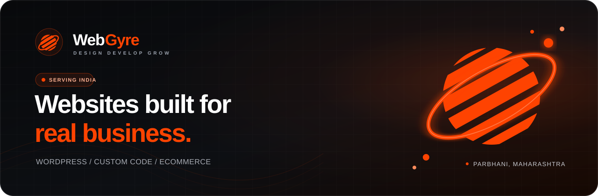

<p align="center">
  <a href="https://webgyre.com/">
    
  </a>
</p>

<p align="center">
  <a href="https://webgyre.com/"></a>
  <a href="https://webgyre.com/portfolio"></a>
  <a href="https://webgyre.com/contact"></a>
</p>

<p align="center">
  <strong>Design. Develop. Grow.</strong><br>
  Website design and development for Indian businesses.
</p>

---

## Websites that have a job to do

WebGyre designs and develops websites for small businesses in India. We work from Parbhani, Maharashtra and deliver online across the country.

The build can be WordPress, hand-coded or ecommerce. The choice depends on who will manage the site, what it needs to sell and how often it will change.

| What we build | What it needs to do |
|:--|:--|
| Business websites | Explain the offer and turn visits into enquiries |
| WordPress websites | Give the team a practical editing workflow |
| Custom frontends | Keep the experience fast, focused and distinctive |
| Ecommerce websites | Sell products with a clear checkout path |
| Redesigns | Fix weak structure, confusing copy and dated presentation |
| Maintenance | Keep an existing website secure, current and working |

## Open the work

Do not take the pitch on trust. Open the product and inspect it.

| Live destination | What you will find |
|:--|:--|
| **[Portfolio](https://webgyre.com/portfolio)** | Working website concepts across clinics, education, retail, travel, hospitality and local services |
| **[Website cost calculator](https://webgyre.com/#calculator)** | A quick estimate based on pages, build type and project features |
| **[Packages and pricing](https://webgyre.com/pricing)** | Current website, ecommerce and maintenance options |
| **[Client brief](https://webgyre.com/client-brief)** | The short form we use to understand a project before work starts |

## What every build is measured against

<table>
  <tr>
    <td width="50%" valign="top">
      <strong>Clear before clever</strong><br><br>
      A visitor should understand the business, the offer and the next step without decoding agency language.
    </td>
    <td width="50%" valign="top">
      <strong>Mobile is the real canvas</strong><br><br>
      Layout, tap targets, forms and performance are checked on the smaller screens customers carry.
    </td>
  </tr>
  <tr>
    <td width="50%" valign="top">
      <strong>Ownership stays with the client</strong><br><br>
      Domain, content and project files should not become a permanent agency lock-in.
    </td>
    <td width="50%" valign="top">
      <strong>Proof before a sales promise</strong><br><br>
      We use working demos, visible pricing and a written scope so both sides know what is being built.
    </td>
  </tr>
</table>

## Working stack

<p>
  
  
  
  
  
  
</p>

We choose the smallest stack that can do the job well. A five-page local-business site should not inherit the maintenance burden of a large application. A store or content-heavy website gets a system the client can operate after launch.

## How a project moves

```text
Brief  ->  Demo  ->  Scope  ->  Build  ->  QA  ->  Launch  ->  Support
```

1. Share the business, audience and required pages.
2. Review a direction before the full build begins.
3. Approve the scope, price and delivery plan.
4. Test the site on mobile and desktop.
5. Launch with the files, access and handover agreed in writing.

## Talk to WebGyre

| | |
|:--|:--|
| Website | [webgyre.com](https://webgyre.com/) |
| Start a project | [Project enquiry form](https://webgyre.com/contact) |
| Send a brief | [Client brief](https://webgyre.com/client-brief) |
| Email | [support@webgyre.com](mailto:support@webgyre.com) |
| Base | Parbhani, Maharashtra, India |
| Social | [X](https://x.com/Webgyre) / [Instagram](https://www.instagram.com/webgyre/) / [YouTube](https://www.youtube.com/@webGYRE) |

<br>

<p align="center">
  <strong>Follow the public work</strong><br>
  Star this repository if you want to see what WebGyre publishes next.
</p>

<p align="center">
  <a href="https://github.com/webgyre/webgyre"></a>
</p>
