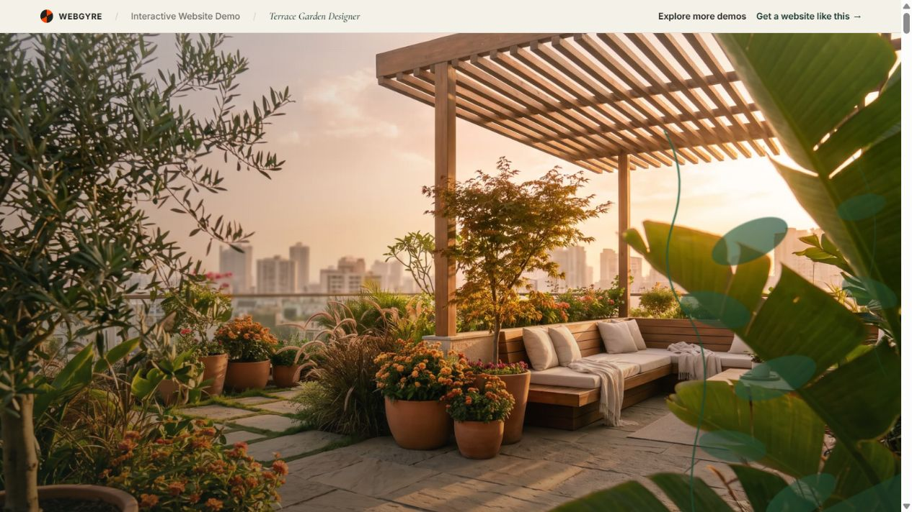
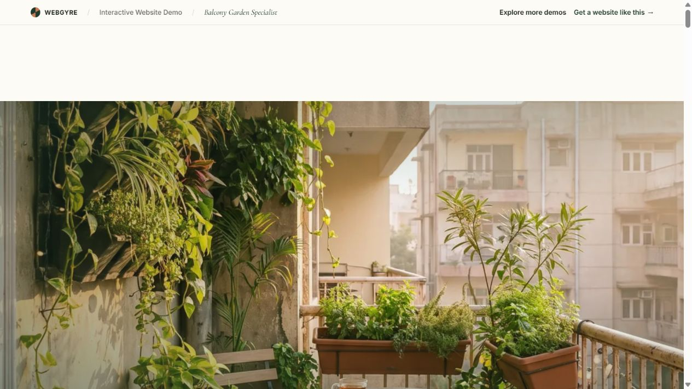
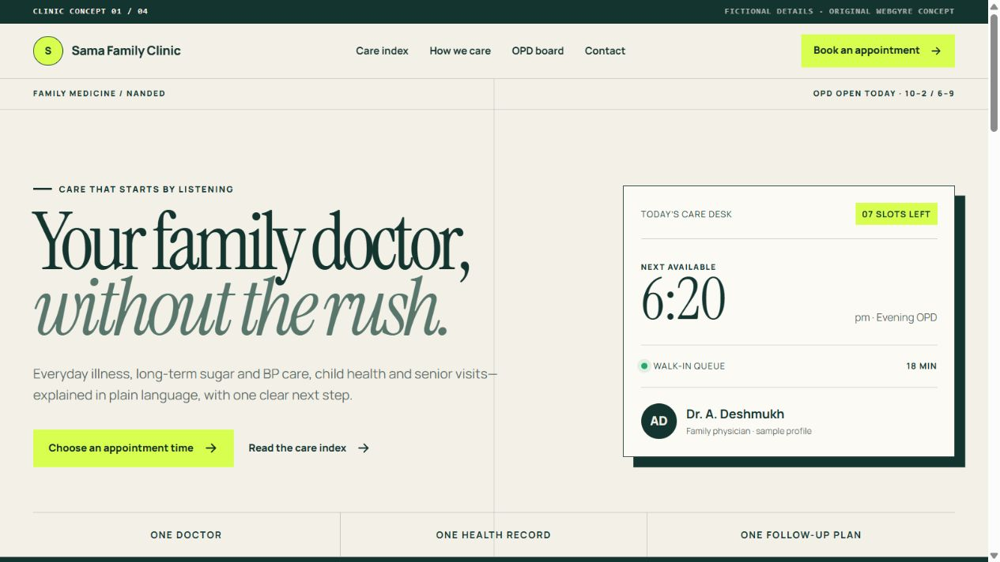
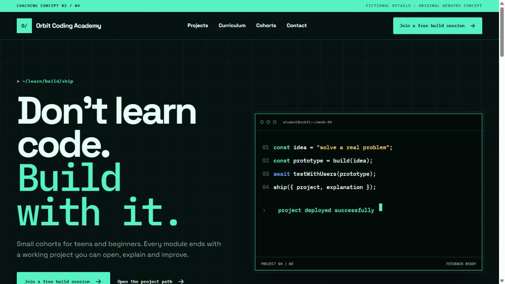

  

  <a href="https://webgyre.com/"><strong>Visit the studio ↗</strong></a> &nbsp; / &nbsp;
  <a href="#selected-design-work"><strong>Selected work</strong></a> &nbsp; / &nbsp;
  <a href="https://webgyre.com/pricing"><strong>Packages &amp; pricing</strong></a> &nbsp; / &nbsp;
  <a href="https://webgyre.com/contact"><strong>Start a project ↗</strong></a>

  <strong>Design. Develop. Grow.</strong> 
  Website design and development for Indian businesses.

---

## Websites that have a job to do

WebGyre designs and develops websites for small businesses in India. We work from Parbhani, Maharashtra and deliver online across the country.

The build can be WordPress, hand-coded or ecommerce. The choice depends on who will manage the site, what it needs to sell and how often it will change.

Your website might need to book a consultation, explain a course, sell a product or show a body of work. We start with that task. It shapes the page structure, the design and the route from a visitor's first question to an enquiry.

## Selected design work

Four different businesses, four different visual directions. These are **fictional concept demos created by WebGyre**, not paid client case studies. Open each one to try the full website.

<table>
  <tr>
    <td width="50%" valign="top">
      
      <h3>01 / Aerleaf</h3>
      
Terrace and rooftop design. Large garden imagery, a before-and-after comparison, space planning and a layered project story.

      <a href="https://webgyre.com/demos/aerleaf-terrace"><strong>Open landscape concept ↗</strong></a>
    </td>
    <td width="50%" valign="top">
      
      <h3>02 / Nestleaf</h3>
      
Small-space garden studio. A footprint planner, sunlight choices and planting ideas turn a visual portfolio into something visitors can use.

      <a href="https://webgyre.com/demos/nestleaf-balcony"><strong>Open balcony concept ↗</strong></a>
    </td>
  </tr>
  <tr>
    <td width="50%" valign="top">
      
      <h3>03 / Sama Family Clinic</h3>
      
A family clinic experience organised around patient concerns, practical care information and an OPD board. A calm direction for a busy setting.

      <a href="https://webgyre.com/demos/sama-family-clinic"><strong>Open healthcare concept ↗</strong></a>
    </td>
    <td width="50%" valign="top">
      
      <h3>04 / Orbit Coding Academy</h3>
      
A coding school presented through projects, curriculum and cohort details. A technical visual language with clear routes into the course.

      <a href="https://webgyre.com/demos/orbit-coding-academy"><strong>Open education concept ↗</strong></a>
    </td>
  </tr>
</table>

**[Browse the full portfolio →](https://webgyre.com/portfolio)**

## From the first page to the daily work

| What we build | What it needs to do |
|:--|:--|
| Business websites | Explain the offer and turn visits into enquiries |
| WordPress websites | Give the team a practical editing workflow |
| Custom frontends | Keep the experience fast, focused and distinctive |
| Ecommerce websites | Sell products with a clear checkout path |
| Redesigns | Fix weak structure, confusing copy and dated presentation |
| Maintenance | Keep an existing website secure, current and working |

### Business websites and custom design

For service companies, clinics, institutes, shops and independent professionals. We work through navigation, service pages, mobile layouts and contact forms together. Brand colours and typography support the business; the page content answers the questions a customer brings with them.

### WordPress that fits your team

For businesses that need to publish articles, edit services or manage content regularly. The brief sets out what your team should be able to change. Theme work, plugins, training and any paid licences belong in the scope, so there is a clear editing and maintenance plan after launch.

### Ecommerce and payment integrations

Product pages, collections, cart and checkout need to work as one buying journey. We discuss product variants, shipping, payment provider requirements and order handling before quoting. Gateway approval, transaction charges and third-party subscriptions remain separate provider requirements.

### Redesign, search foundations and maintenance

An existing site may need better navigation, clearer pages or a simpler enquiry flow. Redesign planning includes existing content and URLs. Search work covers agreed page titles, headings, internal links and metadata. Maintenance can cover updates and fixes; the exact tasks and response expectations are agreed per plan.

**[Compare build and maintenance options →](https://webgyre.com/pricing)**

## Open the work

Try the tools, compare packages and send the details when you are ready.

| Live destination | What you will find |
|:--|:--|
| **[Portfolio](https://webgyre.com/portfolio)** | Working website concepts across clinics, education, retail, travel, hospitality and local services |
| **[Website cost calculator](https://webgyre.com/#calculator)** | A quick estimate based on pages, build type and project features |
| **[Packages and pricing](https://webgyre.com/pricing)** | Current website, ecommerce and maintenance options |
| **[Client brief](https://webgyre.com/client-brief)** | The short form we use to understand a project before work starts |

## What every build is measured against

<table>
  <tr>
    <td width="50%" valign="top">
      <strong>Clear before clever</strong>  
      A visitor should understand the business, the offer and the next step without decoding agency language.
    </td>
    <td width="50%" valign="top">
      <strong>Mobile is the real canvas</strong>  
      Layout, tap targets, forms and performance are checked on the smaller screens customers carry.
    </td>
  </tr>
  <tr>
    <td width="50%" valign="top">
      <strong>Ownership stays with the client</strong>  
      Domain, content and project files should not become a permanent agency lock-in.
    </td>
    <td width="50%" valign="top">
      <strong>Proof before a sales promise</strong>  
      We use working demos, visible pricing and a written scope so both sides know what is being built.
    </td>
  </tr>
</table>

## Working stack

**HTML & CSS** · **JavaScript** · **WordPress** · **Cloudflare** · **GitHub**

We choose the smallest stack that can do the job well. A five-page local-business site should not inherit the maintenance burden of a large application. A store or content-heavy website gets a system the client can operate after launch.

## How a project moves

| Stage | What we work through |
|:--|:--|
| 01 / Brief | Business goals, audience, content, pages and any existing website |
| 02 / Direction | A demo or design direction to review before the full build |
| 03 / Scope | Deliverables, revisions, dependencies, price and delivery plan |
| 04 / Build | Approved pages, responsive layouts and agreed integrations |
| 05 / Review | Mobile and desktop checks, links, forms and content corrections |
| 06 / Handover | Launch, ownership and access details, editing guidance and support scope |

## Built from Parbhani, working across India

We collaborate online through the brief, design review and delivery. A business in Mumbai can review the same working demo as one in Hyderabad or Delhi. Location does not change the need for clear communication and a written scope.

Our service-area pages cover [Parbhani](https://webgyre.com/website-design-company-parbhani), [Mumbai](https://webgyre.com/website-design-company-mumbai), [Pune](https://webgyre.com/website-design-company-pune), [Hyderabad](https://webgyre.com/website-design-company-hyderabad), [Chennai](https://webgyre.com/website-design-company-chennai), [Kolkata](https://webgyre.com/website-design-company-kolkata), [Nizamabad](https://webgyre.com/website-design-company-nizamabad), [Aurangabad](https://webgyre.com/website-design-company-aurangabad), [Nanded](https://webgyre.com/website-design-company-nanded), [Thane](https://webgyre.com/website-design-company-thane) and [Delhi](https://webgyre.com/website-design-company-delhi). Parbhani is our base; these are online service areas.

## Before we start

<strong>What should I send for an estimate?</strong>

Your business name, services or products, required pages, city, existing site if any and a rough deadline. A few websites you like can help explain the direction. Use the [client brief](https://webgyre.com/client-brief); you do not need a technical specification to begin.

<strong>Should I choose WordPress or a hand-coded website?</strong>

WordPress suits regular content editing. A hand-coded site can suit a focused service website or a specific interface. We discuss who will maintain the content, what integrations are needed and what your budget covers before recommending either.

<strong>What is included in the price?</strong>

The approved quote defines pages, features, revisions and handover. Domain renewals, hosting, paid plugins, payment processing and ongoing maintenance should be listed separately where applicable. The [pricing page](https://webgyre.com/pricing) gives the starting options; the project scope determines the final quote.

<strong>Can you work on a site I already have?</strong>

Yes. Share the public URL and the problems you want fixed. We first establish what should stay, what needs rebuilding and how existing pages or integrations will be handled. Send passwords only through an agreed secure access method, never in a public issue.

<strong>Are the portfolio names real clients?</strong>

The four showcased projects are fictional demonstrations of our design and development work. They show layout and interaction decisions. They are not customer endorsements or claims of commercial results.

## WebGyre on GitHub

This repository contains our public profile and brand assets. It is a directory into our work, not the source code or administration system for client websites. Public examples can be explored through the portfolio links above.

For corrections to this profile, [open an issue](https://github.com/webgyre/webgyre/issues). For a business enquiry, use the contact form. Security reports belong in the [private reporting channel](https://github.com/webgyre/webgyre/security/advisories/new); see our [security policy](SECURITY.md).

## Talk to WebGyre

| | |
|:--|:--|
| Website | [webgyre.com](https://webgyre.com/) |
| Start a project | [Project enquiry form](https://webgyre.com/contact) |
| Send a brief | [Client brief](https://webgyre.com/client-brief) |
| Email | [support@webgyre.com](mailto:support@webgyre.com) |
| Base | Parbhani, Maharashtra, India |
| Social | [X](https://x.com/Webgyre) / [Instagram](https://www.instagram.com/webgyre/) / [YouTube](https://www.youtube.com/@webGYRE) |

 

  <strong>Follow the public work</strong> 
  Visit the demos. Share useful feedback. Follow WebGyre for future public work.

  <a href="https://webgyre.com/contact"><strong>Tell us what you want to build ↗</strong></a>  
  WEBGYRE / DESIGN · DEVELOP · GROW / PARBHANI, INDIA

